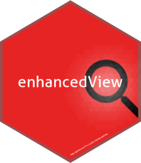
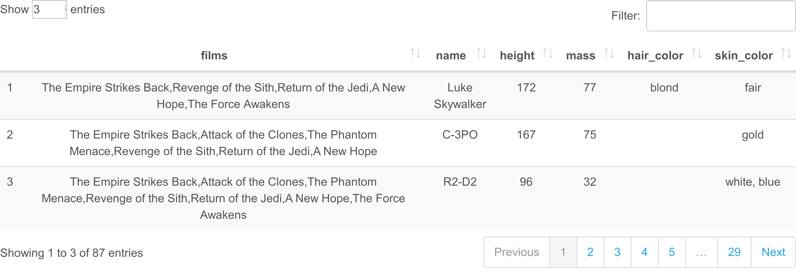
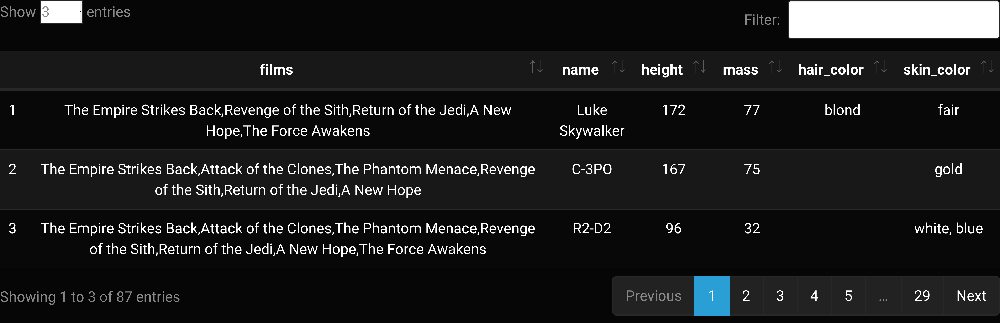
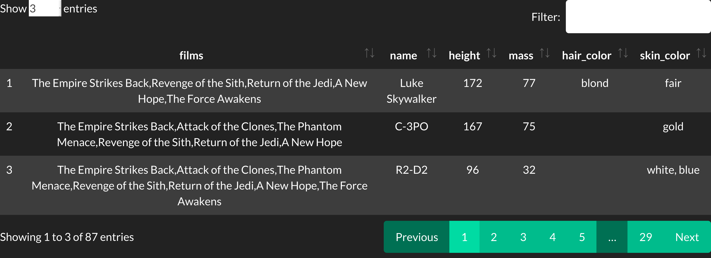
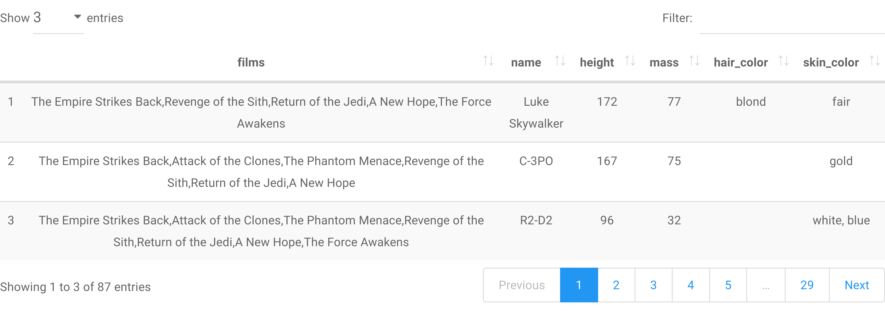
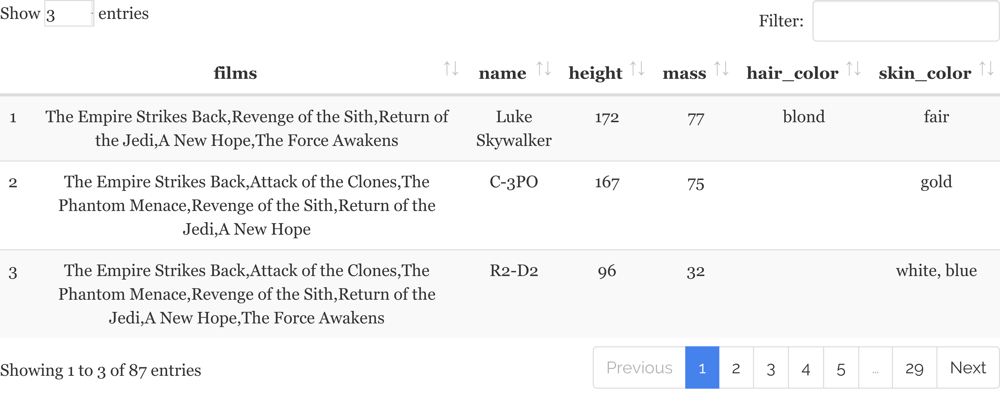
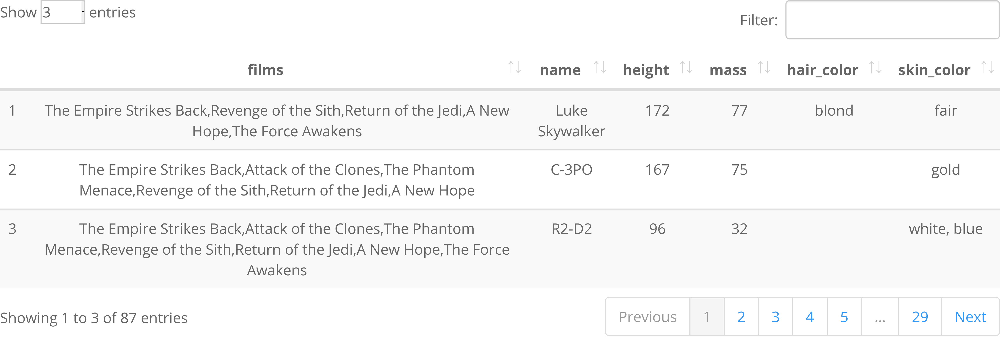
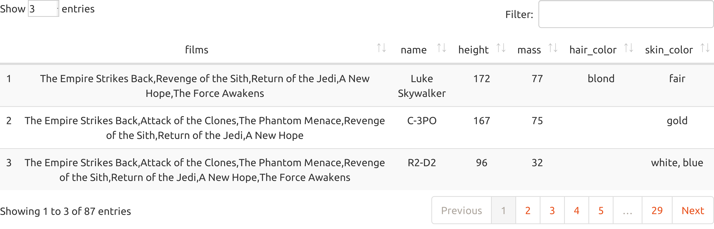
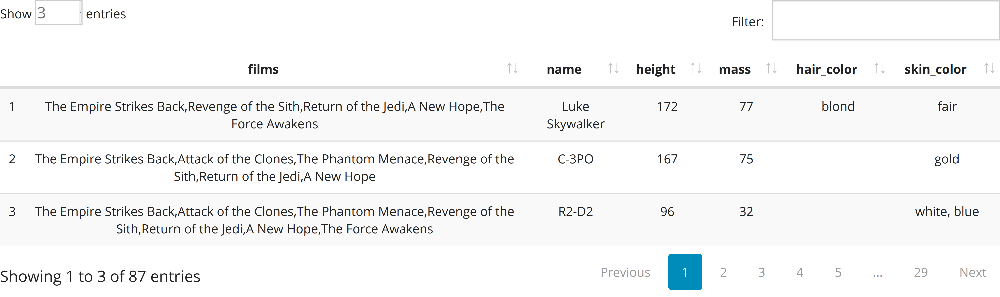

<!-- README.md is generated from README.Rmd. Please edit that file -->

```{r, include = FALSE}
knitr::opts_chunk$set(
  collapse = TRUE,
  comment = "#>",
  fig.path = "man/figures/README-",
  out.width = "100%"
)
```

# enhancedView 

<!-- badges: start -->

[](https://github.com/Tim-Lukas-H/enhancedView/actions)

<!-- badges: end -->

The goal of enhancedView is to ...

## Installation

You can install the most recent version of enhancedView from [GitHub](https://github.com/) with:

``` r
install.packages("devtools")
devtools::install_github("Tim-Lukas-H/enhancedView")
```

## Example

This is a basic example which shows you how to solve a common problem:

```{r example}
library(enhancedView)
## basic example code
```

What is special about using `README.Rmd` instead of just `README.md`?
You can include R chunks like so:

```{r cars}
summary(cars)
```

You'll still need to render `README.Rmd` regularly, to keep `README.md`
up-to-date. `devtools::build_readme()` is handy for this. You could also
use GitHub Actions to re-render `README.Rmd` every time you push. An
example workflow can be found here:
<https://github.com/r-lib/actions/tree/master/examples>.

You can also embed plots, for example:

# Themes

The following shows the available themes using the
[Starswars data](https://dplyr.tidyverse.org/reference/starwars.html) of [dplyr](https://dplyr.tidyverse.org/index.html).

### Cerulean Theme



### Cosmo Theme


### Cyborg Theme



### Darkly Theme



### Flatly Theme


### Journal Theme


### Lumen Theme


### Paper Theme



### Readable Theme



### Sandstone Theme


### Simplex Theme


### Slate Theme


### Spacelab Theme



### Superhero Theme


### United Theme



### Yeti Theme


