<!-- README.md is generated from README.Rmd. Please edit that file -->

# enhancedView 

<!-- badges: start -->

[](https://github.com/Tim-Lukas-H/enhancedView/actions/workflows/R-CMD-check.yaml)

<!-- badges: end -->

This package is basically a simple “off the shelf” version of the
[DT](https://rstudio.github.io/DT/) by Yihui. It replaces the default
data viewer function *View* with a Shiny App.

## Installation

You can install the most recent version of enhancedView from
[GitHub](https://github.com/) with:

``` r
install.packages("devtools")
devtools::install_github("Tim-Lukas-H/enhancedView")
```

# Themes

The following shows the available themes using the [Starswars
data](https://dplyr.tidyverse.org/reference/starwars.html) of
[dplyr](https://dplyr.tidyverse.org/index.html).

### Cerulean Theme

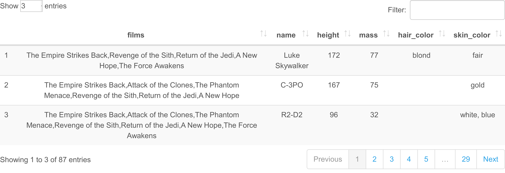

### Cosmo Theme

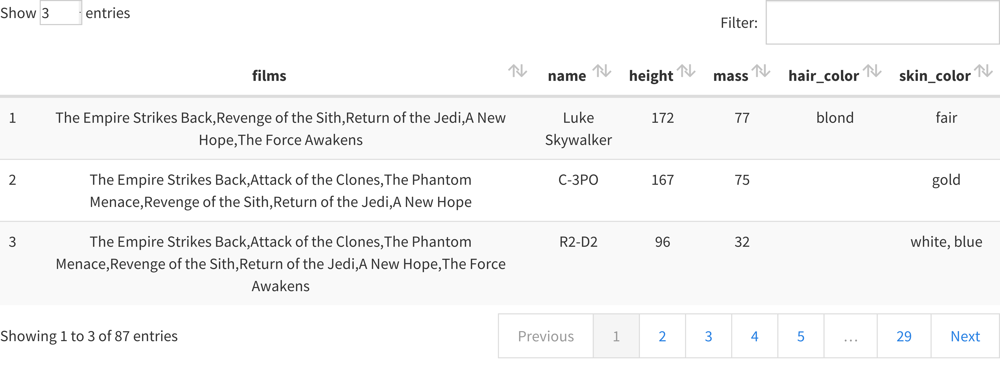

### Cyborg Theme

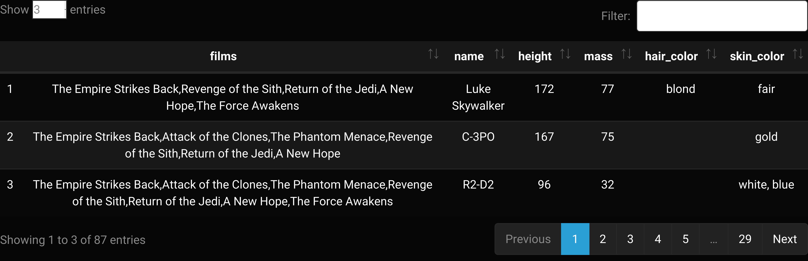

### Darkly Theme

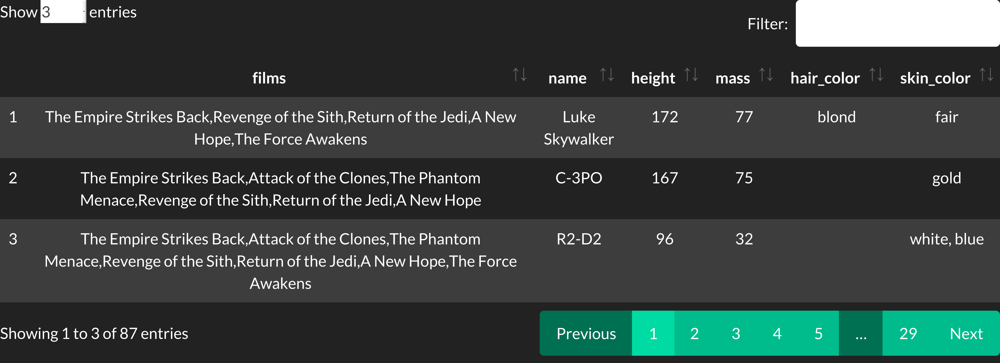

### Flatly Theme

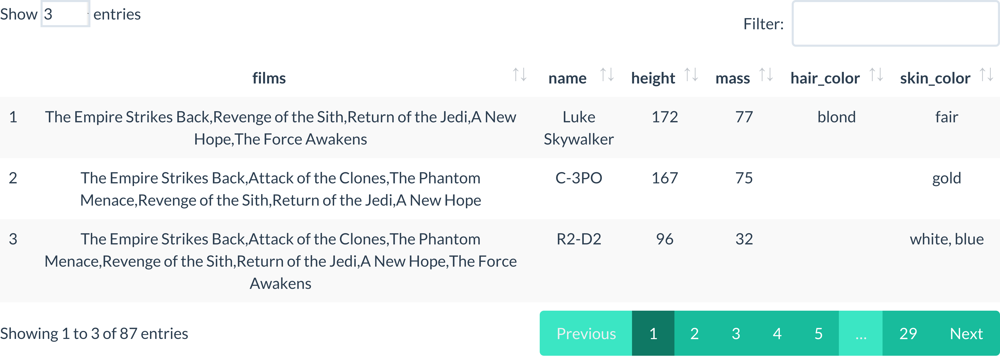

### Journal Theme

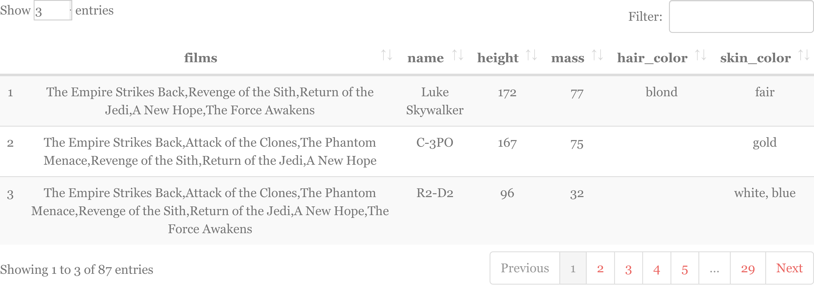

### Lumen Theme

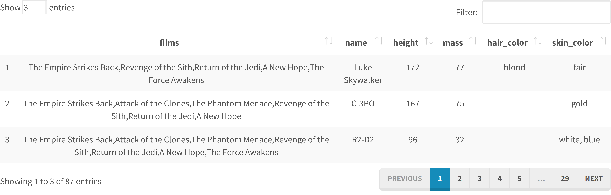

### Paper Theme

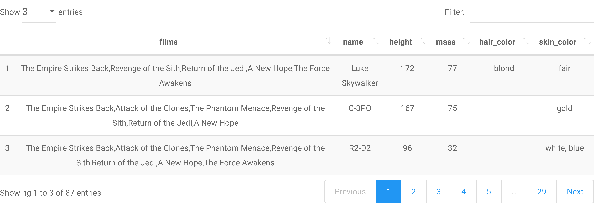

### Readable Theme

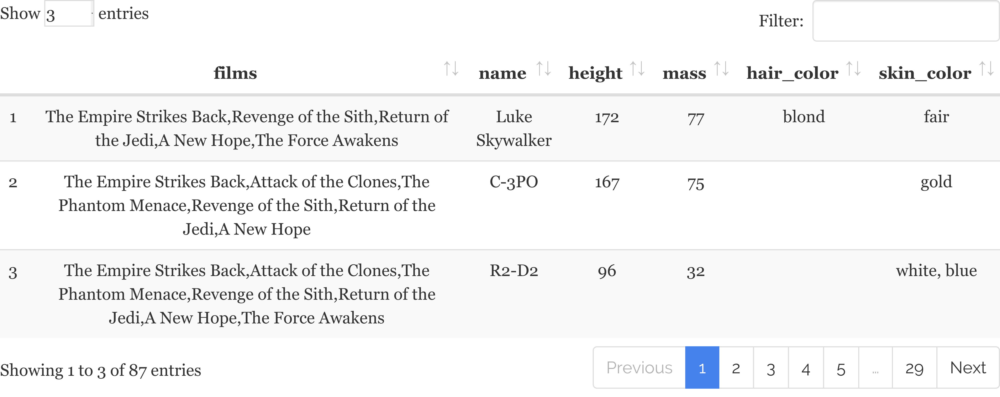

### Sandstone Theme

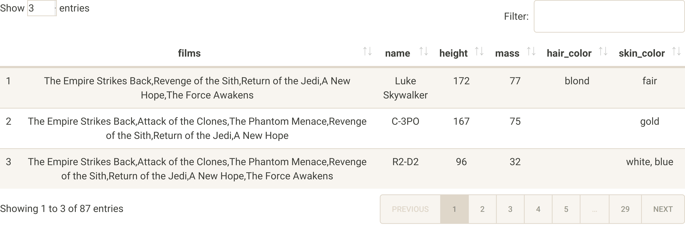

### Simplex Theme


### Slate Theme

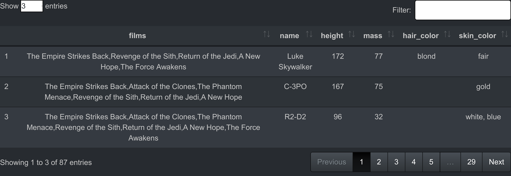

### Spacelab Theme

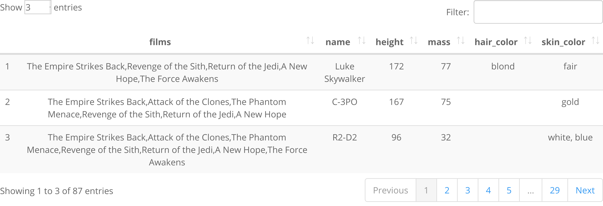

### Superhero Theme

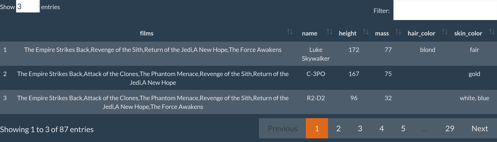

### United Theme

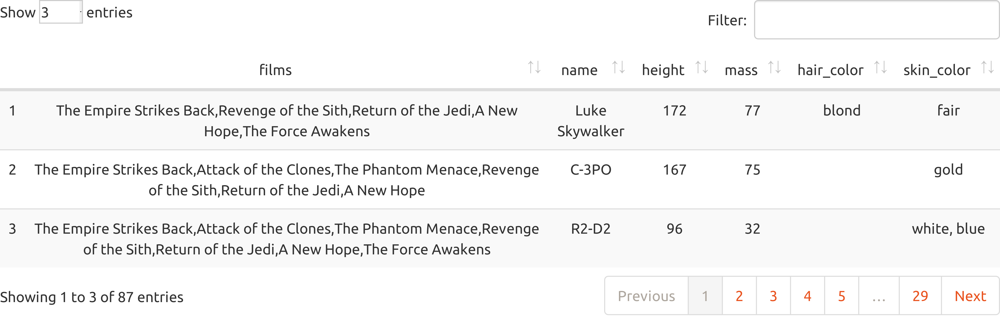

### Yeti Theme

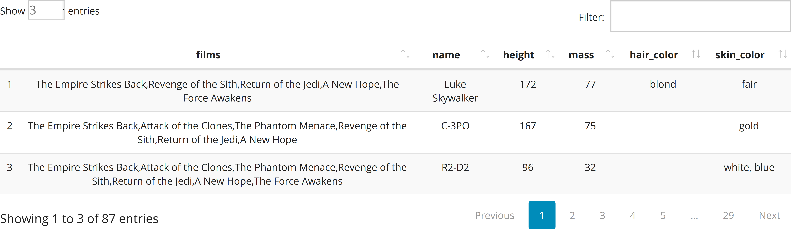
