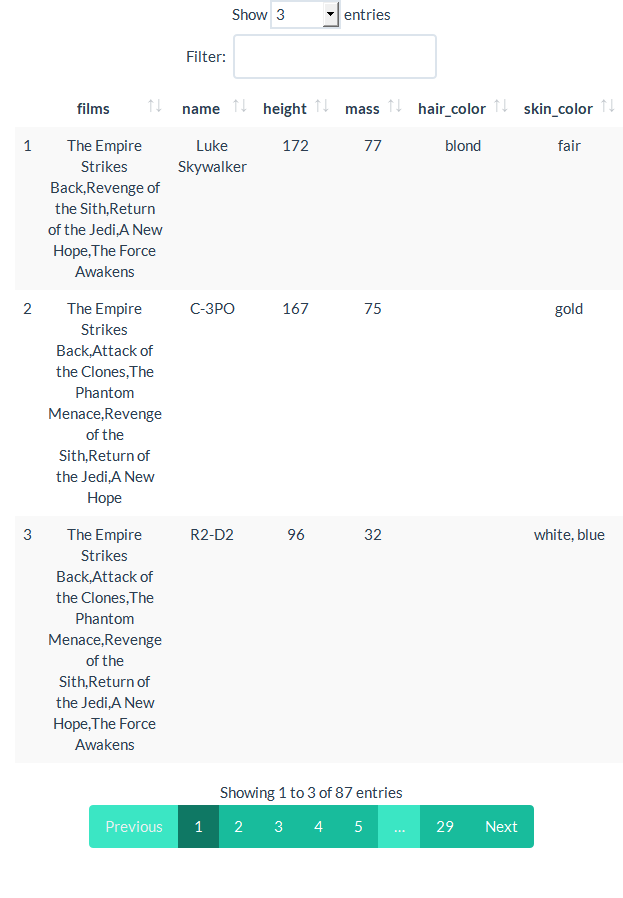

<!-- README.md is generated from README.Rmd. Please edit that file -->

# enhancedView 

<!-- badges: start -->

[](https://github.com/Tim-Lukas-H/enhancedView/actions/workflows/R-CMD-check.yaml)

<!-- badges: end -->

The goal of enhancedView is to …

## Installation

You can install the most recent version of enhancedView from
[GitHub](https://github.com/) with:

``` r
install.packages("devtools")
devtools::install_github("Tim-Lukas-H/enhancedView")
```

## Example

This is a basic example which shows you how to solve a common problem:

``` r
library(enhancedView)
#> 
#> Attaching package: 'enhancedView'
#> The following object is masked from 'package:utils':
#> 
#>     View
## basic example code
```

What is special about using `README.Rmd` instead of just `README.md`?
You can include R chunks like so:

``` r
summary(cars)
#>      speed           dist       
#>  Min.   : 4.0   Min.   :  2.00  
#>  1st Qu.:12.0   1st Qu.: 26.00  
#>  Median :15.0   Median : 36.00  
#>  Mean   :15.4   Mean   : 42.98  
#>  3rd Qu.:19.0   3rd Qu.: 56.00  
#>  Max.   :25.0   Max.   :120.00
```

You’ll still need to render `README.Rmd` regularly, to keep `README.md`
up-to-date. `devtools::build_readme()` is handy for this. You could also
use GitHub Actions to re-render `README.Rmd` every time you push. An
example workflow can be found here:
<https://github.com/r-lib/actions/tree/master/examples>.

You can also embed plots, for example:

    #> 
    #> Attaching package: 'dplyr'
    #> The following objects are masked from 'package:stats':
    #> 
    #>     filter, lag
    #> The following objects are masked from 'package:base':
    #> 
    #>     intersect, setdiff, setequal, union
    #> 
    #> Listening on http://127.0.0.1:8012



# Themes

The following shows the available themes using the [Starswars
data](https://dplyr.tidyverse.org/reference/starwars.html) of
[dplyr](https://dplyr.tidyverse.org/index.html).

### Cerulean Theme


### Cosmo Theme


### Cyborg Theme


### Darkly Theme


### Flatly Theme


### Journal Theme


### Lumen Theme


### Paper Theme


### Readable Theme


### Sandstone Theme


### Simplex Theme


### Slate Theme


### Spacelab Theme


### Superhero Theme


### United Theme


### Yeti Theme


